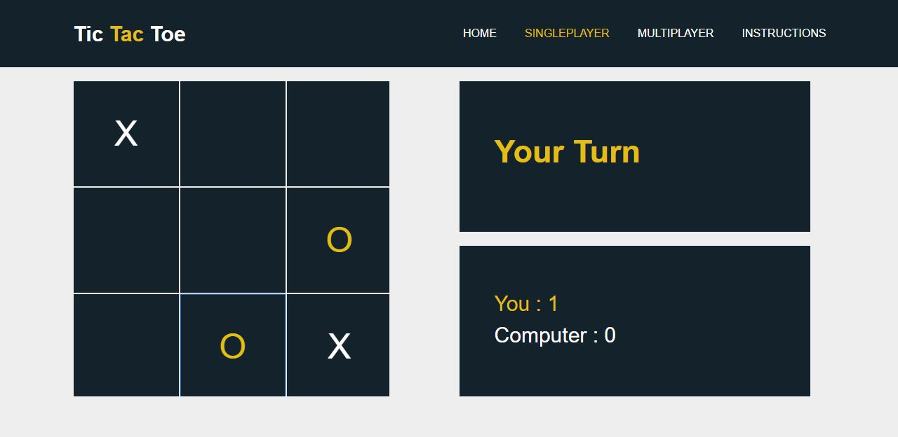
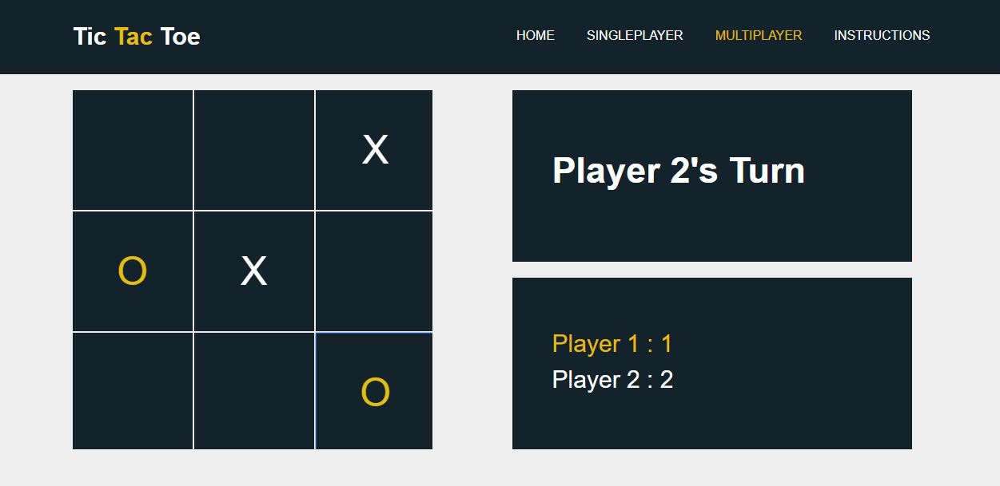

# ThreeXO

Name            : R.S.Wickramasuriya

Registration No : 2017/CS/193

Github Username : randula05

## DISCRIPTION

TheeXO is a web application Which was designed based on Tic Tac Toe game.
It was designed using HTML5, CSS3 & JavaScrcipt.
ThreeXO has two modes, Singleplayer & Multiplayer.
This is very much understandable and also could be easilly taken for further developement.

## How to use

This is a web application. Therefore this can run using a web browser.

## SCREENSHOTS

## Contributions

Contributions are always welcome.
Read the CONTRIBUTING.md file.

## License

[MIT](https://choosealicense.com/licenses/mit/)